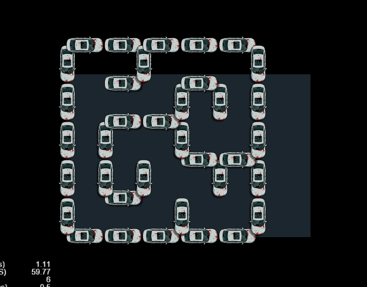

# cocos 迷宫生成算法
------
一样的新需求一样的百度一样的找不到一样的自己动手丰衣足食
__注：由于项目是RPG类型游戏所以要求生成的迷宫不能太过复杂所以采用了递归回溯算法，需要其他算法的朋友可以留言，我有空会加上的，demo中用了工厂设计模式切换算法还是比较容易的 __

### 原理
其实我注释的已经非常清除了我就在简单的说一下吧
* 一开始随机在地图中选择一个区域，加入栈。
* 之后在之前选择的区域周围随机选择一个未打通的区域，将新选择的区域和之前选择区域的墙打通，并把新的区域的加入栈
* 如果四周的区域都打通，就让栈出栈，将当期所选择的区域设置栈新的栈顶，表示回退到上一个区域
* 如果栈为空就跳出

### 截图


### 非cocos环境
本demo使用的cocos create版本是2.2.2，如果是非cocos create的朋友直接使用DFS类即可。
```
//MazeFactory类的createMaze方法
 public static createMaze(data: {
        originPoint: cc.Vec2,    //迷宫生成原点
        horizontalWall: cc.Node; //水平的墙壁
        verticalWall: cc.Node;   //垂直的墙壁
        gridSize: cc.Size;       //迷宫格子尺寸
        row: number,             //行
        col: number,             //列
        root: cc.Node,           //根节点
    }) {
        //todo
}
```

## License
[MIT](./LICENSE)
